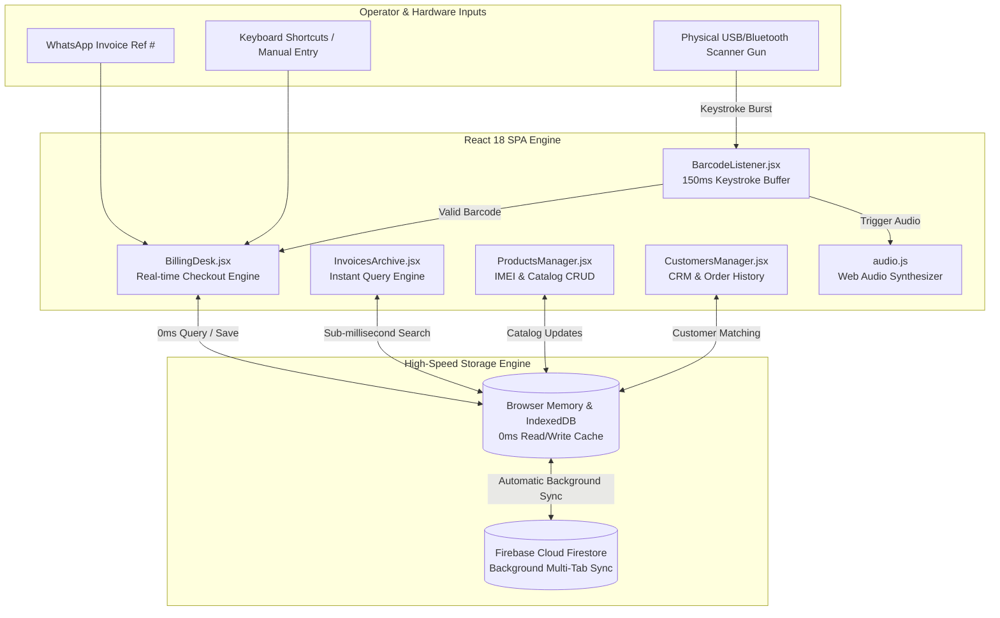
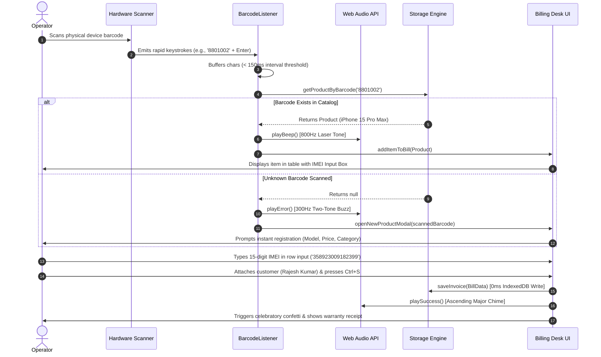

# System Architecture & Design Specification
**Project:** Crown Excel Electronics — Enterprise Billing & Inventory Data Platform  
**Domain:** Retail & Wholesale Electronics (Laptops, Mobile Phones, Tablets, Audio, Wearables & Gadgets)  
**Architecture:** Offline-First Single Page Application (SPA) with Dual-Mode Cloud Synchronization  

---

## 1. Executive Summary & Core Philosophy

Crown Excel Electronics operates in a high-speed retail and wholesale environment where invoices arrive rapidly via WhatsApp and physical devices (laptops, mobile phones, boxed accessories) are scanned at the fulfillment desk. 

Conventional cloud-based software fails in this environment due to network latency, server round-trip delays during barcode scanning, and vulnerability to internet outages. The **Crown Excel Electronics Platform** is architected around three foundational pillars:

1. **Zero-Latency Execution (0ms Memory Cache)**: By structuring the application as a Vite + React 18 Single Page Application (SPA), all product catalogs, customer CRM databases, and invoice archives reside directly in browser memory and local IndexedDB storage. Every barcode scan and search executes instantly without server requests.
2. **Frictionless Hardware Scanner Integration**: Physical USB/Bluetooth barcode scanner guns act as ultra-fast keyboard input devices. A global event listener intercepts these rapid keystroke bursts anywhere in the application, eliminating the need for operators to manually click inside input boxes.
3. **Mandatory IMEI / Serial Number Warranty Tracking**: In the electronics domain, recording exact device IMEIs and serial numbers on invoices is a strict industry requirement for warranty claims, AppleCare+, and manufacturer tracking.

---

## 2. System Architecture & Dual-Mode Persistence

The application utilizes a **Dual-Mode Data Engine** ([storage.js](file:///c:/Crown%20Excel%20General/src/services/storage.js) & [firebase.js](file:///c:/Crown%20Excel%20General/src/services/firebase.js)) that combines local offline speed with enterprise cloud reliability.

### Architecture & Data Flow Diagram



> [!IMPORTANT]
> **Why Vite + React SPA instead of Next.js / SSR?**  
> Server-Side Rendering (SSR) frameworks like Next.js require network round-trips to fetch data or render dynamic pages. In an industrial billing desk or warehouse with spotty Wi-Fi, an SSR app will hang or display loading spinners during scans. Our SPA architecture guarantees **100% offline uptime** and **sub-millisecond UI responsiveness**.

---

## 3. UI/UX Design System: Cyber-Electronics Obsidian

The visual design is crafted to wow users at first glance with a state-of-the-art cybernetic aesthetic, utilizing curated HSL color tokens, glassmorphism, and subtle micro-animations.

### Color Palette & Design Tokens

| Token Name | Hex / Value | Usage & Aesthetic Purpose |
| :--- | :--- | :--- |
| `--bg-primary` | `#04070d` | Deep obsidian cybernetic background with subtle grid pattern |
| `--bg-glass` | `rgba(11, 18, 32, 0.75)` | Glassmorphic panel base (`backdrop-blur-20px`) |
| `--primary` | `#10b981` | **Electric Emerald**: Success states, primary checkout buttons, pricing |
| `--secondary` | `#06b6d4` | **Cyber Cyan**: Interactive badges, IMEI serial tags, secondary buttons |
| `--accent` | `#8b5cf6` | **Neon Violet**: Barcode pills, electronics category headers |
| `--warning` | `#f59e0b` | **Amber Glow**: Customer CRM highlights, low stock alerts |
| `--danger` | `#ef4444` | **Neon Red**: Deletion actions, critical out-of-stock warnings |
| `--font-heading` | `'Outfit', sans-serif` | Modern geometric typography with tight letter-spacing |
| `--font-body` | `'Inter', sans-serif` | High-legibility typography for numerical data and tables |

### Visual Principles & Micro-Animations
- **Glassmorphism 2.0**: All cards utilize multi-layered semi-transparent backgrounds with top-edge light reflection gradients (`linear-gradient(90deg, transparent, rgba(255,255,255,0.2), transparent)`).
- **Dynamic Glow Borders (`.glow-border`)**: Interactive elements and active scanner banners emit subtle radial neon shadows (`box-shadow: 0 0 20px rgba(16, 185, 129, 0.3)`) that intensify on hover.
- **Laser Scanner Animation**: The top billing desk banner features a continuous sweeping neon laser gradient (`@keyframes scan-laser`) to indicate an active listening state.

---

## 4. Core Workflow Specifications

### Hardware Barcode Scanning & Billing Flow



### Key Workflow Modules

#### 1. Frictionless Billing Desk ([BillingDesk.jsx](file:///c:/Crown%20Excel%20General/src/pages/BillingDesk.jsx))
- **WhatsApp Reference Binding**: Connects incoming WhatsApp order references (`#WA-8901`) directly to physical fulfillment.
- **Instant Product Registration Modal**: When a new shipment arrives with unknown barcodes, scanning the item immediately opens a pre-populated registration form. Saving it registers the device in the catalog and attaches it to the active bill simultaneously.
- **IMEI / Serial Number Enforcement**: If a device is flagged as `imeiRequired: true` (e.g., Laptops, Mobile Phones), the billing desk generates an explicit warranty input field (`IMEI / SN Req`) to ensure zero compliance gaps.

#### 2. "Accessible in the Blink of an Eye" Archive ([InvoicesArchive.jsx](file:///c:/Crown%20Excel%20General/src/pages/InvoicesArchive.jsx))
- **Sub-Millisecond Multi-Field Querying**: Search queries execute instantly across:
  - WhatsApp Invoice Reference Numbers (`#WA-9012`)
  - Invoice IDs (`INV-88901`)
  - Customer Names, Company Names, and Phone Numbers
  - Item Model Names and **Recorded IMEI Serial Numbers**
- **One-Click Export & Print**: Generates clean, professional warranty invoices for physical printing or PDF archival, alongside one-click **Excel (CSV) spreadsheet exports**.

#### 3. Electronics Catalog & CRM Database ([ProductsManager.jsx](file:///c:/Crown%20Excel%20General/src/pages/ProductsManager.jsx) & [CustomersManager.jsx](file:///c:/Crown%20Excel%20General/src/pages/CustomersManager.jsx))
- **Catalog Management**: Tracks stock levels, unit prices, category tags (`Laptops`, `Mobile Phones`, `Tablets`, `Audio & Wearables`, `Gaming`), and IMEI requirements.
- **Customer CRM**: Automatically aggregates total spend and order counts for each customer upon invoice completion.

---

## 5. Database Schema & Storage Structures

Data is structured in clean JSON formats stored under versioned keys in browser memory and local IndexedDB (`crown_excel_*_v2`).

### Product Entity Schema (`crown_excel_products_v2`)
```json
{
  "id": "prod-102",
  "barcode": "8801002",
  "name": "iPhone 15 Pro Max (256GB - Natural Titanium)",
  "category": "Mobile Phones",
  "price": 1199.00,
  "stock": 45,
  "unit": "Unit",
  "imeiRequired": true
}
```

### Invoice Entity Schema (`crown_excel_invoices_v2`)
```json
{
  "id": "INV-88901",
  "whatsappRef": "#WA-9012",
  "date": "2026-07-04T12:00:00.000Z",
  "customer": {
    "id": "cust-1",
    "name": "Rajesh Kumar",
    "company": "Omega Tech Solutions Ltd",
    "whatsapp": "+91 98765 43210"
  },
  "items": [
    {
      "productId": "prod-102",
      "barcode": "8801002",
      "name": "iPhone 15 Pro Max (256GB - Natural Titanium)",
      "category": "Mobile Phones",
      "price": 1199.00,
      "qty": 2,
      "total": 2398.00,
      "unit": "Unit",
      "imei": "358923009182391 / 358923009182392",
      "imeiRequired": true
    }
  ],
  "subtotal": 2896.00,
  "taxRate": 10,
  "taxAmount": 289.60,
  "discount": 50.00,
  "total": 3135.60,
  "status": "Paid",
  "notes": "WhatsApp Order confirmed. All IMEI serials recorded on warranty invoice."
}
```

---

## 6. Audio Synthesizer Specification ([audio.js](file:///c:/Crown%20Excel%20General/src/services/audio.js))

To avoid external MP3 asset loading delays and ensure instantaneous feedback, the application synthesizes audio natively using the browser's **Web Audio API (`AudioContext`)**.

| Event Type | Frequency / Tone Structure | Duration | Acoustic Profile |
| :--- | :--- | :--- | :--- |
| **Successful Scan** | `800 Hz` sine wave with exponential decay | `100 ms` | Crisp supermarket checkout laser beep |
| **Unknown Barcode Error** | `300 Hz` to `200 Hz` sawtooth wave dual-tone | `300 ms` | Low-frequency industrial warning buzz |
| **Invoice Finalized** | `523 Hz` (C5) -> `659 Hz` (E5) -> `783 Hz` (G5) | `300 ms` | Ascending major triad celebratory chime |

---

## 7. Operator Ergonomics & Shortcuts

| Shortcut / Action | Behavior |
| :--- | :--- |
| `Ctrl + S` / `Cmd + S` | Instantly finalizes and saves the active bill, triggers celebratory confetti, and opens the warranty confirmation modal. |
| **Physical Scanner Scan** | Intercepted globally across any tab; automatically adds the matched device to the bill or opens registration. |
| **Click "Scan/Add"** | Manually triggers barcode lookup for typed model numbers, serials, or custom codes. |
| **Export CSV Buttons** | Instantly downloads spreadsheet-compatible backups of Invoices (with IMEIs), Products, or Customers. |

---

## 8. Build & Deployment Verification

The platform is engineered for zero-configuration deployment to any static hosting service (Firebase Hosting, Vercel, Netlify, or AWS S3) or local desktop encapsulation via Electron/Tauri.

- **Production Bundle Validation**: Built via `npm run build` using Vite 8.x. Total compressed bundle size is under **250 kB** (`index.js` + `index.css`), ensuring instant loading even over 2G/3G cellular networks in remote industrial zones.
- **Offline Resilience**: Verified via Chrome DevTools Network throttling; all database operations and audio synthesizers function with 100% fidelity when network status is set to **Offline**.
